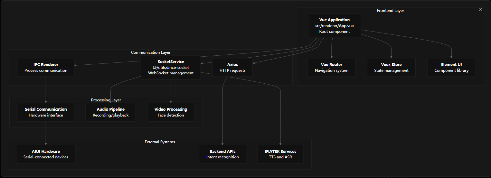
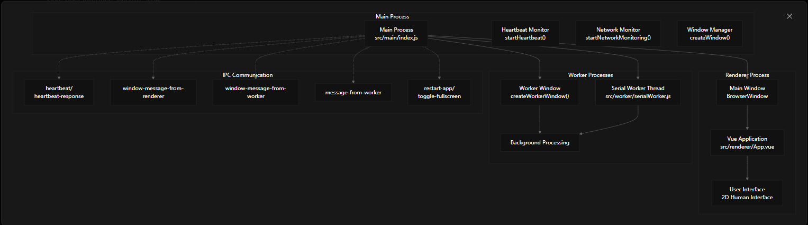

# 应用程序概述

## 目的和范围
这是一款基于 Electron 的人机交互系统，旨在实现实时语音识别、视频处理和硬件通信。该应用程序可用作复杂的自助服务终端或嵌入式界面，集成多种通信协议、音频处理功能和 AI 驱动的交互功能。

## 应用程序架构
vHuman 应用程序采用多进程 Electron 架构，每个进程负责不同的职责。主进程负责协调应用程序生命周期和进程间通信，而其他专门的进程则负责处理用户交互、硬件通信和后台任务。
该应用程序使用 Electron 的多进程架构来分离关注点并确保系统稳定性。主进程中的 createWindow() 函数初始化主用户界面，而 createWorkerWindow() 和 createWorker() 函数则建立后台处理功能。

## 核心系统组件
该应用程序集成了几个关键子系统，它们协同工作，提供全面的人机交互体验：

## 应用程序初始化和生命周期

该应用程序遵循结构化的初始化过程，建立所有必要的流程和通信渠道：

| *Phase  阶段* | *Function  功能* | *Description  描述* |
| :---: | :---: | :---: |
| Setup  设置 | app.on('ready') | 协议注册和窗口创建 |
| Window Creation  窗口创建 | createWindow() | 主界面初始化 |
| Worker Setup  工人设置 | createWorkerWindow() | 后台处理窗口 | 
| Monitoring  监控 | startHeartbeat() 、  startNetworkMonitoring() | 系统健康监控 |
|  IPC 设置 | Event listeners  事件监听器 | 进程间通信通道 |

应用程序在创建窗口之前注册自定义方案并初始化 GPU 加速。\createWindow() 函数根据环境配置主浏览器窗口的特定尺寸和全屏行为 。

## 渲染器进程设置

渲染器进程使用基本服务初始化 Vue.js 应用程序： main.js
渲染进程作为主要的用户界面层，处理所有视觉交互并通过 IPC 通道与主进程协调。

## 系统监控和健康
该应用程序实施全面的监控系统，以确保可靠性和正常运行：

### 心跳监控
- 主进程每 60 秒通过 startHeartbeat() 发送心跳
- 渲染进程通过 heartbeat-response IPC 通道进行响应
- 如果心跳失败，应用程序会自动重启

### 网络监控
通过定期检查来监控网络连接：

# 应用程序架构
介绍 vHuman 应用程序的多进程 Electron 架构，包括进程通信模式、窗口管理以及主进程、渲染进程和工作进程之间的协调。有关核心用户界面组件的详细信息，请参阅核心用户界面 。有关特定通信协议的信息，请参阅通信系统 。

## 多进程架构概述
vHuman 应用程序遵循 Electron 的多进程架构模式，具有三种不同的进程类型，每种进程类型在整个系统中发挥特定的作用。

## 主流程架构
主进程作为整个应用程序的中央协调器，管理窗口生命周期、进程间通信和系统监控。

| *组件* |	*类/函数* |	*作用* |
| :---: | :---: | :---: |
| 应用程序入口 | createWindow() | 主窗口创建和配置 |
| Worker管理 | createWorkerWindow() | 隐藏后台任务的工作窗口 |
| 线程管理 | createWorker() | 串行通信工作线程 |
| 健康监测 | startHeartbeat() | 应用程序响应监控 |
| 网络监控 | startNetworkMonitoring() | 网络连接检查 |
| IPC 协调 | ipcMain 处理程序 | 进程之间的消息路由 |

## 窗口配置
Window Creation Flow

createWindow()

Environment Check
isDevelopment

Development Config
width: 1080
height: 1920
fullscreen: false

Production Config
width: ENV_WIDTH
height: ENV_HEIGHT
fullscreen: true

BrowserWindow
nodeIntegration: true
contextIsolation: false

## 进程间通信架构
IPC 通道配置

消息路由实现,主进程实现了集中式消息路由系统：

| *IPC 处理程序* | *源进程* | *目标进程* | *目的* |
| :---: | :---: | :---: | :---: |
| heartbeat-response | Renderer | Main | 应用程序健康监控 |
| window-message-from-renderer | Renderer | Worker Window | 命令转发 |
| window-message-from-worker | Worker Window | Renderer | 后台任务结果 |
| message-from-worker | Serial Worker | Renderer | 硬件通信事件 |
| restart-app | Renderer | Main | 应用程序重启触发器 |
| toggle-fullscreen	| Renderer | Main | 显示模式控制 |

## 工作进程架构
该应用程序采用两种类型的工作进程来处理后台操作，而不会阻塞主 UI 线程。
 
### 工作窗口进程
工作窗口是一个隐藏的 BrowserWindow 实例，它为后台处理提供单独的 JavaScript 上下文：

### 串行工作线程
针对不同消息类型处理计算数据
